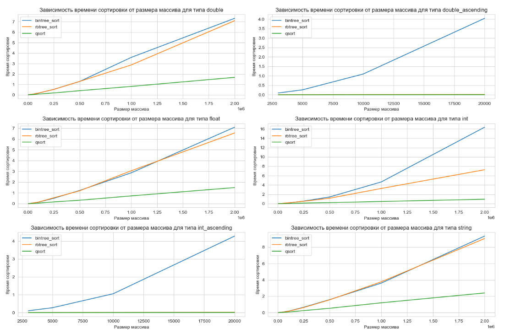
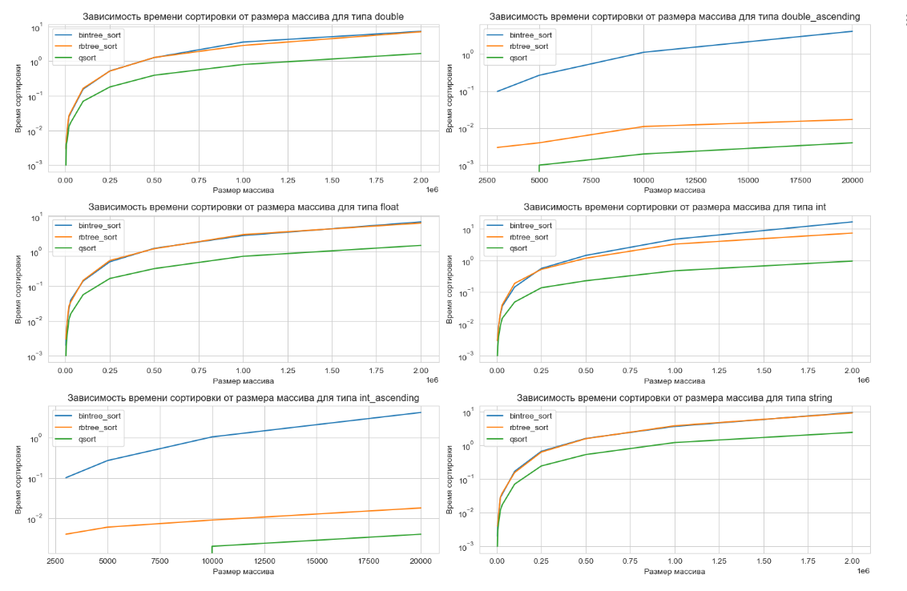

# EcoLab 1 - Variant 40
## Эко компонент сортировки деревом

### Общая информация

В проекте представлены два компонента, которые реализуют метод сортировки с сигнатурой аналогичной сигнатуре функции qsort из стандартной библиотеки.
В Unit Test директории на исполняемый файл, демонстрирующий работу методов и замеряющий время их работы.

### Компоненты

* `1F5DF16EE1BF43B999A434ED38FE8F3A` - Компонент с рекурсивной сортировкой с помощью обычного бинарного деревом.

* `1F5DF16EE1BF43B999A434ED38FE8F3D` - Компонент с нерекурсивной сортировкой с помощью Красно-черного дерева.

### Cборка

Сборка проекта реализована через `CMake`. \
В качестве компилятора использовался компилятор MSVC. \
Запуск проекта производился в IDE Clion.

Производится сборка компонент в `.dll` и в `.lib`.

### Алгоритм

#### Описание метода

Сортировка деревом — это метод сортировки данных, который использует структуру бинарного дерева для упорядочивания элементов.

Суть метода:
* Создание бинарного дерева поиска (BST):
  * Сначала создается пустое бинарное дерево поиска.
  * Затем каждый элемент из входного массива добавляется в дерево. При добавлении элемента в BST, он сравнивается с текущим узлом дерева. Если элемент меньше текущего узла, он добавляется в левое поддерево, если больше — в правое поддерево. Этот процесс повторяется рекурсивно, пока не будет найдено место для нового узла.
* Построение отсортированного списка:
  После того как все элементы добавлены в BST, дерево преобразуется в отсортированный список. Это делается путем обхода дерева в порядке "левый узел, корень, правый узел" (In-Order Traversal). Этот обход гарантирует, что элементы будут посещены в отсортированном порядке.

#### Подходы

1. Binary Search Tree - сортировка обычным бинарным деревом поиска. Асимптотика вставки элемента в дерево в среднем `O(log(N))`, поэтому асимптотика сортировки на случайных данных в среднем `O(N * log (N))`, где N - размер массива. Однако на отсортированных (или близких к таковым) массивах обычное бинарное дерево поиска вырождается до связного списка, из-за чего асимптотика вставки увеличивается до `O(N)`, поэтому сложность сортировки может в худшем случае выродиться до `O(N^2)`.
2. AVL-деревья - это бинарные деревья поиска, которые автоматически балансируются после каждой операции вставки или удаления. Балансировка обеспечивается за счет вращения поддеревьев. AVL-деревья обеспечивают эффективную сортировку и поиск данных, сохраняя время выполнения операций вставки и поиска в пределах O(log n), где n — количество узлов в дереве. Асимптотика сортировки `O(N * log(N))`. Однако высокая стоимость вращения AVL-деревьев делает их использование невыгодным (большая константа у `O(N * log(N))`), поэтому в этой лабораторной их реализация не представлена. 
3. Red-Black Tree (Красно-черное дерево) - это вид бинарного дерева поиска, которое автоматически балансируется после каждой операции вставки или удаления. Балансировка обеспечивается за счет использования цветов узлов (красный и черный) и строгих правил, которые гарантируют, что путь от корня до самого глубокого листа содержит одинаковое количество черных узлов. Это обеспечивает, что высота дерева остается логарифмической относительно количества узлов, что позволяет поддерживать эффективные операции вставки, удаления и поиска с временем выполнения O(log n). При этом эти деревья не гарантируют полной сбалансированности.  Асимптотика сортировки `O(N * log(N))`

Сложность о памяти для всех подходов одинакова - `O(N)`, так как для каждого элемента массива создается узел дерева.

Исходя из вышеописанных характеристик подходов, в рамках лабораторной реализованы:
1. Binary Search Tree - как классический подход, не замедляемый вращениями дерева.
2. Red-Black Tree - как сортировка с более стабильной асимптотикой за счет того, что худший случай с отсортированными элементами здесь невозможен. Однако у этой сортировки

### Сравнение времени работы

#### Зависимость времени выполнения сортировки от размера массива

##### Графики в линейных осях

##### Графики в логарифмических осях

По результатам тестирования на случайных данных видно, что сортировки деревом значительно проигрывают быстрой сортировке по времени выполнения. \
При сортировке случайных чисел типа int, сортировка на КЧД за счет балансировки показывает скорость выполнения на порядок выше, чем у BST.

При этом несмотря на оптимизации КЧД, связанные с балансировкой, графики не отражают различий во времени выполнения двух подходов - Binary Tree (Бинарное дерево) и Red-black tree (Красно-черное дерево) - при сортировках на типах string, float и double.
Видно, что различия между подходами непостоянны, КЧД при некоторых наборах данных выполняется быстрее, чем бинарное дерево вследствие несбалансированности последнего, но в некоторых случаях, наоборот, среди деревьев выигрывает BST вследствие меньшей константы выполнения (за счет отсутствия поворотов).

Более заметна разница подходов на возрастающих данных - КЧД за счет балансировки показывает результаты, сравнимые с qsort (отличается только на константу), и значительно выигрывает у бинарного дерева (так как время выполнения сортировки BST растет квадратично).

По логарифмическим графикам видно, что несмотря на то, что сортировки деревом проигрывают qsort, их асимптотика одинакова при случайных данных - `O(N * log(N))`, однако на отсортированных данных сложность BST возрастает до `O(N^2)`, тогда как сложности КЧД и qsort на отсортированных данных отличаются только на константу.

# EcoLab 2

Компонент `CEcoLab1` дополнительно реализует 2 интерфейса калькулятора:
* `IEcoCalculatorX`
* `IEcoCalculatorY`

* `IEcoCalculatorY` может быть реализован при помощи механизма включения компонентов `CEcoCalculatorD` или `CEcoCalculatorE`.
* `IEcoCalculatorX` реализован при помощи агрегирования компонента `CEcoCalculatorB` или включения компонента `CEcoCalculatorA`.

Для того чтобы все интерфейсы можно было запросить необходимо скопировать соответствующие `.ddl`-файлы из директории `CalculatorComponents/BuildFiles` в папку с артефактами билда. 

*Примечание: в папке `CalculatorComponents/BuildFiles` находятся динамические библиотеки, скомпилированные под `Windows x86`. Если параметры вашей системы отличаются, то необходимо использовать `dll`, скомпилированные под вашу систему. Нужные `dll` можно найти в `InsideACOM/Lessons`.*

Компонент CEcoLab1RBTree дополнительных интерфейсов не реализует.